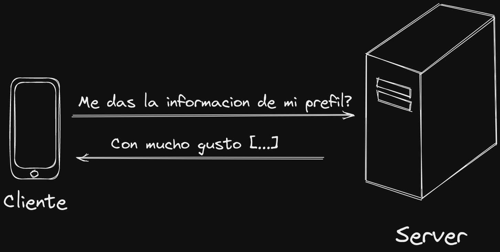
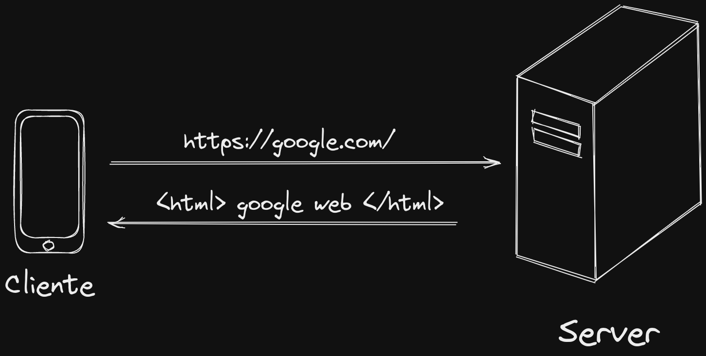

# Cliente - Servidor

El modelo cliente-servidor es un modelo de arquitectura de red que se utiliza para la comunicación entre diferentes sistemas informáticos. En este modelo, el sistema que solicita un servicio o recurso se conoce como el cliente y el sistema que proporciona los datos y recursos se conoce como el servidor.

Los clientes y servidores se comunican a través de una red utilizando un protocolo de comunicación estándar. El cliente envía una solicitud al servidor, y el servidor procesa la solicitud y envía una respuesta al cliente. Este proceso se realiza de manera asíncrona, lo que significa que el cliente y el servidor no necesitan estar en línea al mismo tiempo para comunicarse.

Es utilizado en muchos sistemas informáticos, como en la World Wide Web, donde los navegadores web actúan como clientes y los servidores web proporcionan contenido y servicios. En este caso, el cliente envía una solicitud de página web al servidor web, y el servidor web envía la página web de vuelta al cliente.

Este modelo también se utiliza en aplicaciones empresariales, donde los clientes pueden ser aplicaciones de escritorio o móviles. En este caso, el cliente solicita información o realiza una operación en la aplicación, y el servidor procesa la solicitud y devuelve los resultados al cliente.

Una de las ventajas del modelo es que permite la separación de preocupaciones entre los clientes y los servidores, lo que facilita la implementación, el mantenimiento y la evolución de los sistemas informáticos.

Siguiente lección → [HTTP](http.md)
