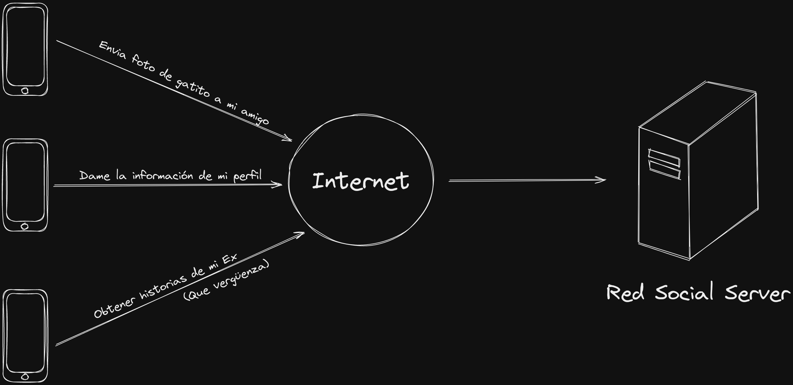
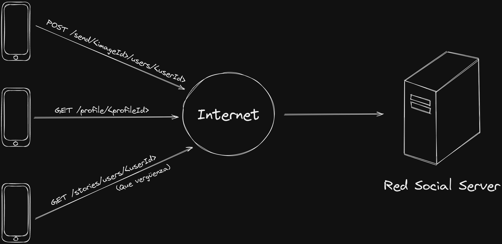

# HTTP

El Protocolo de Transferencia de Hipertexto (HTTP, por sus siglas en inglés) es un protocolo de red utilizado para la transferencia de información en la World Wide Web (WWW). HTTP se basa en un modelo de cliente-servidor, donde un cliente hace una solicitud a un servidor y espera una respuesta.

El proceso de comunicación en HTTP comienza cuando un cliente, como un navegador web o una aplicacion movil, envía una solicitud a un servidor para acceder a un recurso (una imagen, un video, un audio, una pagina web, etc) u obtener informacion (Texto plano, JSON, XML, ect).



La solicitud consta de una línea de solicitud, que incluye el método HTTP utilizado, la URL del recurso y la versión del protocolo HTTP, así como un conjunto de encabezados que proporcionan información adicional sobre la solicitud y puede tener o no un cuerpo. Ejemplo:

```
GET /users HTTP/1.1
Content-Type: application/json
```




El servidor recibe la solicitud y, si el recurso solicitado está disponible, responde con un código de estado HTTP y un conjunto de encabezados que proporcionan información adicional sobre la respuesta, como los codigos de respuesta, tal vez te suene familiar el 404 (recurso no encontrado). Si la solicitud se completa correctamente, el servidor envía el recurso solicitado en el cuerpo de la respuesta.

```
HTTP/1.1 200 OK
Content-Type: application/json

[
    {
        "user":  "user example",
        "name":  "name example",
        "email": "user@domain.com"
    }
]
```

> Mas acerca de los codigos de respuesta HTTP: https://http.cat/

HTTP también utiliza cookies para mantener el estado de la sesión entre el cliente y el servidor. Una cookie es una pequeña pieza de información que se almacena en el navegador del cliente y se envía al servidor con cada solicitud. Esto permite que el servidor mantenga información sobre la sesión, como la identidad del usuario o las preferencias del usuario.

En resumen, HTTP es un protocolo de red que permite la transferencia de información en la World Wide Web. Utiliza un modelo de cliente-servidor y varios métodos para indicar la acción que se debe realizar en un recurso.

Siguiente lección → [REST API](README.md)
